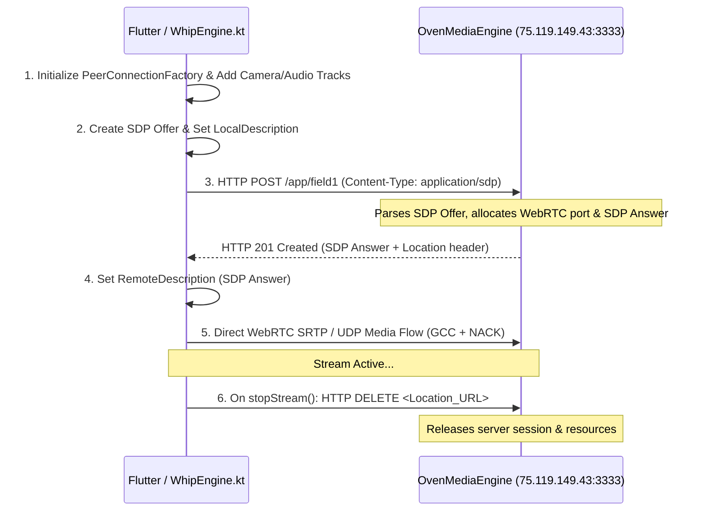

# WHIP (WebRTC-HTTP Ingestion Protocol) Native Implementation

This document provides technical documentation for the native WebRTC WHIP broadcast capability added to `station_cast` via the [`station_broadcast`](plugins/station_broadcast) plugin.

---

## 1. Overview & Purpose

**WHIP (WebRTC-HTTP Ingestion Protocol - RFC draft)** brings sub-second, real-time streaming to mobile broadcasting by combining standard WebRTC media transport with simple HTTP SDP negotiation.

### Why WHIP / WebRTC over SRT or RTMP?
* **Google Congestion Control (GCC)**: Dynamic adaptive bitrate control natively built into WebRTC adjusts video bitrate instantly when cellular signals drop, preventing buffer bloat and heavy pixelation/macroblocking.
* **ARQ / NACK & FEC**: Efficient packet loss recovery without fixed latency penalties.
* **Sub-second Latency**: Glass-to-glass latency typically `< 500ms`.

---

## 2. Architecture & Components

```
+-------------------------------------------------------------------+
|                        Flutter App Layer                          |
|         StationBroadcast.startStream(DestinationConfig.webrtc)    |
+---------------------------------+---------------------------------+
                                  | MethodChannel ("tv.stationcast/broadcast")
+---------------------------------v---------------------------------+
|                    StationBroadcastPlugin                         |
|         (android/.../StationBroadcastPlugin.kt)                   |
+---------------------------------+---------------------------------+
                                  | protocol == "webrtc"
+---------------------------------v---------------------------------+
|                         WhipEngine.kt                             |
|      - PeerConnectionFactory & PeerConnection (org.webrtc.*)       |
|      - Camera2 Capturer & AudioTrack                              |
|      - SDP Offer Generation                                       |
|      - HTTP POST (application/sdp) -> WHIP Server                  |
|      - HTTP DELETE Teardown                                       |
+---------------------------------+---------------------------------+
                                  | WebRTC SRTP Media
+---------------------------------v---------------------------------+
|                    OvenMediaEngine Server                         |
|                 http://75.119.149.43:3333/app/...                 |
+-------------------------------------------------------------------+
```

### Key Files Modified & Created

* **[`plugins/station_broadcast/android/build.gradle.kts`](plugins/station_broadcast/android/build.gradle.kts)**: Added WebRTC Android dependency (`io.getstream:stream-webrtc-android:1.3.0`).
* **[`plugins/station_broadcast/android/.../WhipEngine.kt`](plugins/station_broadcast/android/src/main/kotlin/tv/stationcast/station_broadcast/WhipEngine.kt)**: Native Kotlin WHIP implementation using Google WebRTC SDK. Handles camera capture, SDP offer creation, HTTP POST exchange, and HTTP DELETE session teardown.
* **[`plugins/station_broadcast/android/.../StationBroadcastPlugin.kt`](plugins/station_broadcast/android/src/main/kotlin/tv/stationcast/station_broadcast/StationBroadcastPlugin.kt)**: MethodChannel handler routing `startStream` / `stopStream` calls for WebRTC streams to `WhipEngine`.
* **[`plugins/station_broadcast/lib/src/models.dart`](plugins/station_broadcast/lib/src/models.dart)**: Dart model defining `BroadcastProtocol.webrtc` and `DestinationConfig.webrtc(webrtcUrl: ...)`.

---

## 3. WHIP Signaling Flow



---

## 4. Usage in Flutter Code

```dart
import 'package:station_broadcast/station_broadcast.dart';

final stationBroadcast = StationBroadcast();

// 1. Initialize camera & encoder settings
await stationBroadcast.initialize(const EncoderConfig(
  width: 1280,
  height: 720,
  fps: 30,
  videoBitrateBps: 3000000,
));

// 2. Start WHIP WebRTC Stream
await stationBroadcast.startStream(
  const DestinationConfig.webrtc(
    webrtcUrl: 'http://75.119.149.43:3333/app/field1',
  ),
);

// 3. Listen to stream events & link statistics
stationBroadcast.events.listen((event) {
  print('Broadcast event: ${event.state} - ${event.message}');
});

stationBroadcast.stats.listen((stats) {
  print('Bitrate: ${stats.bitrateBps} bps, RTT: ${stats.rttMs} ms');
});

// 4. Stop stream
await stationBroadcast.stopStream();
```

---

## 5. Server Configuration & Endpoints

OvenMediaEngine WHIP endpoints follow this pattern:

* **HTTP WHIP Ingest Endpoint**: `http://75.119.149.43:3333/app/{stream_name}` or `http://75.119.149.43:3333/app/{stream_name}/whip`
* **HTTPS/TLS WHIP Endpoint**: `https://75.119.149.43:3334/app/{stream_name}`
* **ICE Ports**: UDP `10000-10003` (as configured in OvenMediaEngine `Server.xml`).
